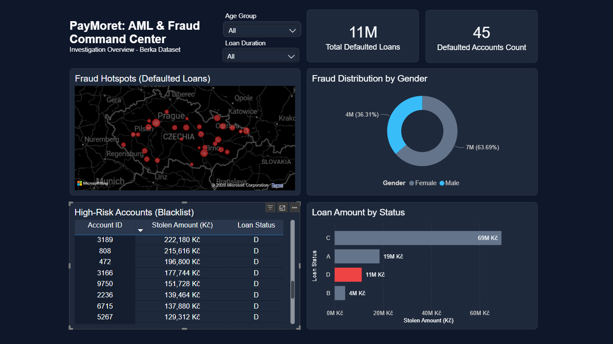

# PayMoret: FinTech Anti-Money Laundering (AML) & Fraud Risk Command Center

## 📌 Project Overview
This project is a comprehensive **End-to-End Data Analytics and Fraud Investigation** conducted on a real-world financial dataset. The goal was to identify sophisticated financial crimes, specifically **Smurfing** (Money Laundering) and **Bust-Out Fraud** (Loan Defaults), providing actionable insights and a Security Operations Center (SOC) style dashboard for a FinTech Neobank's risk management team.

### 💾 Data Source
The dataset used for this project is the **Czech Financial Dataset (Berka Dataset)** originally from the 1999 PKDD Discovery Challenge. It contains real, anonymized banking transactions, loans, and client demographic data.
* **Dataset Link:** [Czech Financial Bank Dataset - Kaggle](https://www.kaggle.com/datasets/mariammariamr/1999-czech-financial-dataset)

---

## 🕵️‍♂️ The Business Case (The Scenario)
The management at **PayMoret** noticed suspicious patterns in transaction volumes and high loan default rates. As a Data Analyst, I was tasked to investigate:
1. Are there accounts being used for money laundering (Smurfing)?
2. What is the demographic and geographical profile of these suspects?
3. What is the total financial risk exposure caused by these flagged accounts?

> 🔗 **Want to dive deeper into the SQL methodology and thought process? Read the full [Case Study & Analytical Journey](Case_Study.md).**

---

## 🛠️ Data Engineering, Cleaning & DAX (The Foundation)
Before building the investigation dashboard, the raw data required rigorous cleaning and advanced modeling using a tri-tool approach (Excel, SQL, and Power BI DAX):

* **Initial Triage (Excel):** Conducted preliminary data profiling, handled basic null values, and performed structural formatting for specific tables.
* **Database Normalization (SQL):** Resolved carriage return issues (`\r\n`) during CSV imports, standardized temporal data (`DATE` formats), and translated banking terminology from Czech (`PRIJEM`, `VYDAJ`) to English.
* **Advanced DAX Engineering (Power BI):** * Built custom DAX measures for calculating **Average Defaulted Exposure** dynamically.
  * Engineered a custom `Age Group` bucketing logic to handle historical birth dates properly, preventing skewed demographic visuals.
  * Cleaned relational model artifacts (e.g., handling `Blank` loan durations in 1-to-Many relationships).

---

## 🚀 Investigation Pipeline & Key Findings

### 1. Smurfing Detection & The "Bust-Out" Fraud
I identified highly active accounts performing suspicious transaction patterns. The investigation revealed that these activities were precursors to a planned bank heist. Suspects successfully applied for large loans and subsequently moved to **Status D** (Default/Unpaid).

### 2. Demographic Profiling
* **Gender Distribution:** Defaulted exposure is distributed across both genders, with specific high-value clusters.
* **The Temporal Trap:** I avoided a common analytical error by calculating the suspects' age **at the exact time of the crime** (creating dynamic age buckets like '30-45 Years'), rather than their current age, providing an accurate criminal profile.

### 3. Geospatial Analysis (Hotspots)
The analysis revealed that fraud is highly concentrated in **Prague (The Capital)** and major industrial hubs like **Ostrava** and **Brno**, suggesting organized crime syndicates targeting high-volume urban branches.

---

## 📈 Key Insights & Results
| Metric | Insight |
| :--- | :--- |
| **Flagged Accounts** | **45 High-Risk Accounts** isolated for AML investigation. |
| **Total Risk Exposure** | **11,217,804 Kč** (~11M Kč) in total unrecovered loans. |
| **Average Exposure** | **~249,000 Kč** average hit per defaulted account. |
| **Risk Hotspots** | Urban centers (Prague, Brno, Ostrava) show the highest concentration of defaulted exposure. |

---

## 📷 Project Visuals

### 🖥️ Desktop Dashboard (Command Center)

*Designed with Web UI/UX principles: Dark theme for reduced eye strain (SOC standard), custom cross-filtering logic for isolated investigation (preventing native BI cross-highlighting confusion), and compliance-standard terminology.*

### 🎥 Interactive Demo

---

## 📂 Project Structure
* `SQL_Scripts/`: Contains `01_Data_Preparation.sql` and `02_Fraud_Analysis.sql`.
* `Dataset/`: Contains the cleaned CSV exports used for the data model.
* `Dashboard/`: Contains the `.pbix` interactive Power BI dashboard file.
* `04_Assets/`: Screenshots of query results, GIFs, and dashboard layouts.

---

## 💡 Technical Skills Demonstrated
* **Advanced SQL:** CTEs, Window Functions, Complex Joins, Data Aggregation.
* **Data Modeling:** Snowflake schema design and relational logic.
* **Power BI & DAX:** Custom metrics, dynamic categorization, interaction control (Filter vs. Highlight).
* **UI/UX Design for BI:** Pixel-perfect alignment, custom headers, eliminating visual noise, color psychology for risk management.
* **Business Acumen:** Translating raw data into compliance-standard metrics (Risk Exposure, Defaulted Accounts).
